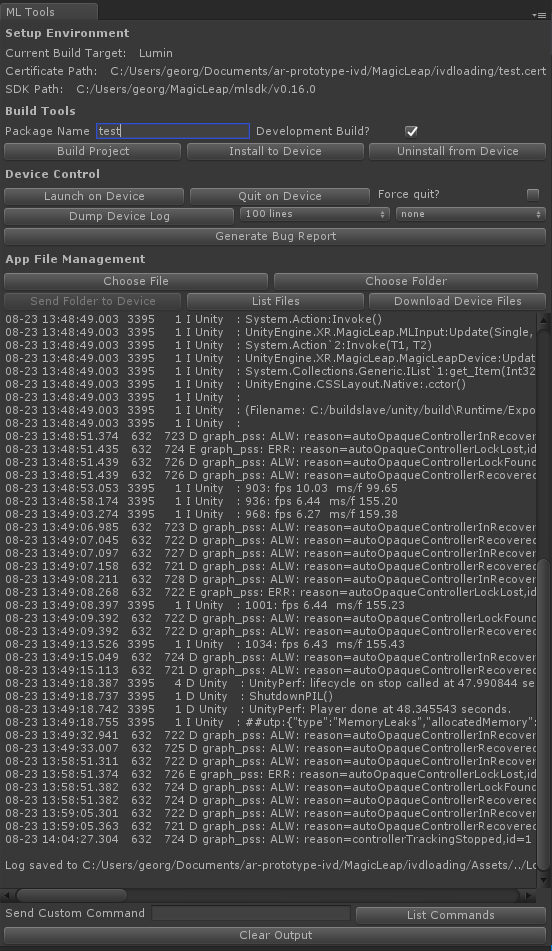

### Magic Leap Device Bridge Unity Bindings

While jumping into the ML ecosystem I noticed that too often I found myself resorting to command line to interface with the device using [MLDB](https://creator.magicleap.com/learn/guides/magic-leap-device-bridge-reference). To simplify my workflow I created Unity Editor bindings for some of the more commonly used options. Here are the requirements:

1) A version of Unity that supports the Lumin SDK. Can be downloaded from [here](https://unity3d.com/partners/magicleap).

2) Lumin SDK downloaded from the ML Package Manager [here](https://creator.magicleap.com/downloads/lumin-sdk/unity).

3) Enable MLDB access on your device by going to `Settings -> Device -> Creator Mode` and selecting `Enable MLDB Access`.

This photo is self-explanatory for supported features, but you can delve into the code if you're curious about how I've implemented the bindings. The gist of it is that a new process is spawned with every command sent to the device using `mldb.exe` on Windows and `mldb` on OSX, and cleaned up once the command is complete. Note that this code by default currently works with only one headset connected to the computer as I imagine most developers are not using more than one headset for prototyping yet. I will add multi-device support in time, and if there is significant interest I'll accelerate it.

Import the script into an `Editor` folder in your project to use it. It will appear in the top toolbar under `Magic Leap`. If you have any suggestions on features you'd like to see added (or if you run into any bugs), please post an issue. 

#### A few notes

* If you wish to build your project with more options than just being a development build, please go through Unity's Build Settings and not MLTools.
* File management on-device over MLDB will ***not*** work unless a package is marked as a development build. Hopefully ML changes this in the future.
* The console output is displayed in a window for convenience. 
* Packages are automatically signed by default.
* `Application.persistentDataPath` in Unity returns the `%packagename%/documents/C2/` folder on device. Files are automatically uploaded into this folder, and `List Files` returns its contents.
* I've put in a few checks to squash most potential avenues of bugs, but I'm sure I forgot a few. If you manage to break the interface please let me know and I'll patch that issue.
* If they don't yet exist, a `Build`, `DeviceFiles`, and `Logs` folder are generated in the root of your project. Builds, downloaded device files, and device logs are saved there respectively.
* Scenes added to the build are taken from the current selected scenes in Unity's Build Settings.

